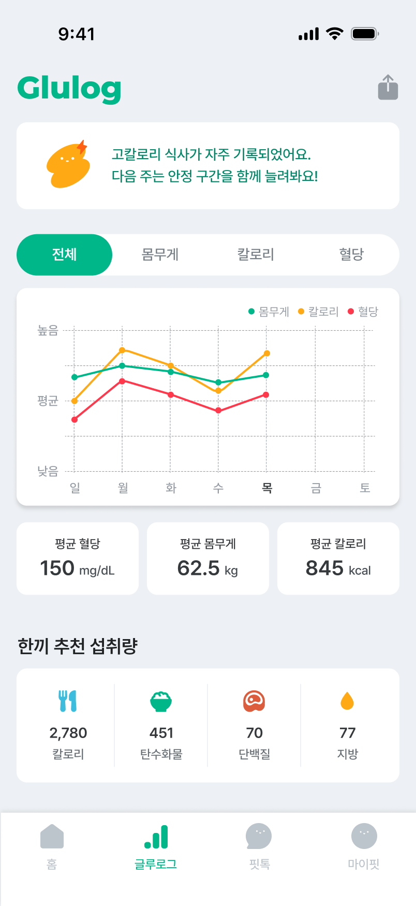
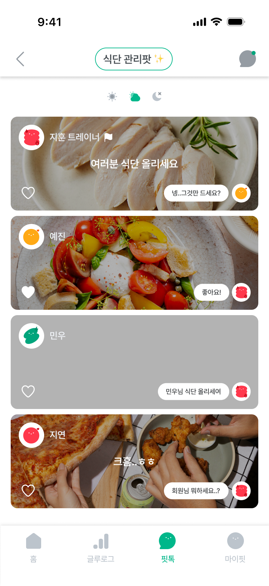

# GluFit — 혈당 관리 기반 건강 라이프스타일 앱

> "더 건강한 한 끼의 시작" — 혈당(Glucose)과 피트니스(Fit)를 하나로

GluFit은 혈당 수치와 식단·운동 데이터를 통합 관리하고, 커뮤니티를 통해 건강한 습관을 함께 만들어가는 iOS 헬스케어 앱입니다.  
당뇨·고혈압·비만 등 만성질환을 가진 사용자부터 식단 관리에 관심 있는 누구에게나 알맞도록 설계되었습니다.

---

## 주요 화면

| 홈 | 글루로그 | 핏톡 | 식단 그룹 |
|:---:|:---:|:---:|:---:|
|  |  |  |  |

---

## 핵심 기능

### 홈 (Home)
- **주간 캘린더** — 날짜별 식단·혈당 기록 한눈에 확인
- **혈당 상태 카드** — 현재 혈당 수치에 따른 안전·경고·위험 구간 시각화
- **식단 캐러셀** — 아침·점심·저녁 식사 기록 및 빠른 추가
- **카메라 식단 입력** — 음식 사진 촬영으로 칼로리 + 혈당 상승 지수 자동 예측

### 글루로그 (GluLog)
- **AI 피드백** — 기간별 식단 패턴을 분석해 맞춤형 조언 제공
- **통합 그래프** — 혈당(mg/dL) · 체중(kg) · 칼로리(kcal)를 탭 전환으로 비교
- **통계 요약** — 평균 혈당 · 평균 체중 · 평균 칼로리 한눈에 확인
- **하루 추천 섭취량** — 칼로리 · 탄수화물 · 단백질 · 지방 목표 대비 현황

### 핏톡 (FitTalk)
- **친구 식단 공유** — 팔로잉 유저의 실시간 식단 사진 피드
- **소그룹 채팅** — 식단 관리팟·운동 인증팟 등 목적별 소규모 그룹
- **핏챌린지** — 참여 중인 챌린지 우선 노출, 카테고리(식단·운동·체중) 필터

### 마이핏 (MyFit)
- 개인 건강 정보 및 목표 관리

---

## 온보딩 플로우

```
회원가입 / 로그인
   │  카카오·네이버·애플·메타·구글 소셜 로그인 지원
   ↓
기본 정보 입력 (이름, 생년월일 등)
   ↓
신체 정보 입력 (키, 체중)
   ↓
최근 혈당 수치 입력 (mg/dL) — 모를 경우 건너뛰기 가능
   ↓
건강 특이사항 선택 (당뇨 / 고혈압 / 고지혈증 / 과체중·비만 / 심혈관 질환 등)
   ↓
식품 제한 설정 (알레르기, 채식 여부 등)
   ↓
메인 화면 진입
```

---

## 기술 스택

| 항목 | 내용 |
|---|---|
| 플랫폼 | iOS |
| UI 프레임워크 | SwiftUI |
| 폰트 | Pretendard (SemiBold · Medium · Bold 등), Montserrat ExtraBold |
| 디자인 시스템 | `GlufitColors`, `GlufitFonts` (커스텀 익스텐션) |
| 디자인 툴 | Figma |

---

## 프로젝트 구조

```
Glufit/
├── GlufitApp.swift             # 앱 진입점, 폰트 등록
├── ContentView.swift           # Splash → Onboarding → Main 라우팅
├── DesignSystem/
│   ├── GlufitColors.swift      # 전역 컬러 토큰
│   └── GlufitFonts.swift       # 전역 폰트 토큰
└── Views/
    ├── Main/
    │   ├── SplashView.swift
    │   └── MainTabView.swift   # 하단 탭 바 (홈 · 글루로그 · 핏톡 · 마이핏)
    ├── Home/
    │   ├── HomeView.swift
    │   ├── HomeTopCard.swift
    │   ├── WeeklyCalendar.swift
    │   ├── FoodCarousel.swift
    │   ├── MealCameraView.swift
    │   └── MealPredictionView.swift
    ├── GluLog/
    │   └── GluLogView.swift
    ├── FitTalk/
    │   ├── FitTalkView.swift
    │   ├── DietGroupView.swift
    │   └── GroupChatView.swift
    ├── MyFit/
    │   └── MyFitView.swift
    └── Onboarding/
        ├── Onboarding1LoginView.swift
        ├── Onboarding2BasicInfoView.swift
        ├── Onboarding3BodyInfoView.swift
        ├── Onboarding4BloodSugarView.swift
        ├── Onboarding5HealthConditionView.swift
        ├── Onboarding6FoodRestrictionView.swift
        └── OnboardingHelpers.swift
```

---

## 실행 방법

1. Xcode 15 이상에서 `Glufit.xcodeproj`를 열어주세요.
2. 시뮬레이터 또는 실기기(iOS 17+)를 선택한 뒤 `⌘R`로 빌드 및 실행합니다.
3. 별도의 외부 의존성(SPM, CocoaPods)은 없습니다.
